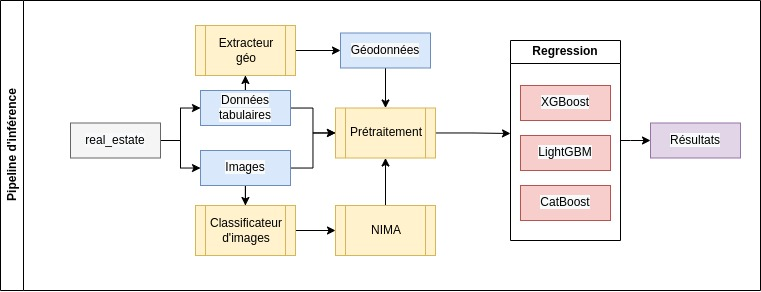

## Real estate price prediction — ILB Challenge (2022)

This repository contains Abdellah's personal submission for the Institut Louis Bachelier (ILB) Challenge Data 2022 on real-estate price prediction. It combines strong tabular modeling, image-derived signals, and careful feature engineering to predict listing prices from both metadata and 1–6 property photos.

### Highlights
- **Ensemble of gradient-boosting models** (XGBoost, LightGBM, CatBoost) on engineered tabular features
- **Image signal infusion** via caption-derived features and optional image quality/class labels
- **Geospatial enrichment** (population, lat/lng transforms, polar features, Places-derived counts)
- **Robust CV and blending** with out-of-fold tracking and weighted averaging



---

## Repository structure
- `data/`: Expected data layout and brief notes
- `tools/`: Preprocessing, encodings, feature selection, caption extraction, metrics
- `models/`: Tuned hyperparameters (`hyperparameters.yaml`)
- `regressor/`: Image-only EfficientNet Lightning prototype (experimental)
- `RoomNet/`: Legacy room-type classifier experiments (not required for final submission)
- `notebooks/`: EDA and experiments (images, captioning, dataset exploration)
- `docs/`: Diagrams and visuals
- `submit.py`: End-to-end tabular pipeline + CV + blending + submission writer

---

## Data
The original challenge provides ~50k listings (tabular) and ~300k photos (~30GB). This project expects the official CSVs under `data/tabular/` and images under `data/reduced_images/` following the challenge naming conventions:

- `data/tabular/X_train_J01Z4CN.csv`
- `data/tabular/y_train_OXxrJt1.csv`
- `data/tabular/X_test_BEhvxAN.csv`
- `data/reduced_images/train/ann_<id>/*.jpg` and `data/reduced_images/test/ann_<id>/*.jpg`

Optional/derived data that the pipeline can consume when present:
- `data/geodata/` (cached geopopulation and Google Places-derived features)
- `data/image_captions/full_df.csv` (caption features per listing)
- `data/classification_quality/` (image quality/class aggregates, e.g., NIMA)

See `data/README.md` for a high-level overview of the expected folders.

---

## Setup
All Python dependencies are listed in `requirements.txt`.

```bash
pip install -r requirements.txt
```

GPU is recommended for faster CV and any image/caption experiments.

---

## Approach
The final submission is an ensemble over tabular models trained on a rich feature set that augments raw metadata with geospatial transforms and optional image-derived features.

- **Preprocessing/config**: `preprocess.yaml`
  - Drop low-signal columns (e.g., DPE/ghg categories, use numeric values instead when available)
  - Encoding: frequency encoding (`city`), optional target/label/quantile encodings
  - Geospatial: `add_geopopulation[_2]`, Places counts, distance features, PCA and polar transforms/rotations
  - Scaling: robust scaling by default
  - Target transform: log-price
  - Optional: one-hot, polynomial interactions, iterative/mean/min imputations

- **Image signal** (optional but supported by the code):
  - Caption extraction with a vision-language model (GIT) in `tools/captioner.py`
  - Caption parsing into boolean/count features in `tools/preprocess.py`
  - Optional image quality/class aggregates (NIMA-style) in `tools/preprocess.py`

- **Models/hyperparameters**: `models/hyperparameters.yaml`
  - Tuned configurations for XGB (GPU), LGBM (GBDT), and CatBoost (GPU)

- **Training and blending**: `submit.py`
  - 50-fold KFold CV per model, OOF tracking, and test-time averaging
  - Final prediction is a weighted blend of log-space predictions: `[0.25, 0.45, 0.30]` for XGB/LGB/CAT

---

## How to reproduce (end-to-end)
1) Place the official CSVs in `data/tabular/` and images in `data/reduced_images/` as described above.

2) (Optional) Generate caption features for image-augmented runs:
   - Adjust paths inside `tools/captioner.py` if needed, then run it to produce caption JSONs and assemble `data/image_captions/full_df.csv`.

3) Run the main pipeline to train with CV and write the submission file:

```bash
python submit.py
```

Outputs:
- Blended test predictions at `data/final_submission_169.csv`
- Blended train predictions (OOF-like) at `data/train_submission.csv`

You can tweak preprocessing via `preprocess.yaml` and model hyperparameters via `models/hyperparameters.yaml`.

---

## Key files
- `tools/preprocess.py`: Full preprocessing and feature engineering pipeline (geo, encodings, scaling, captions, image quality)
- `preprocess.yaml`: Switches and parameters for preprocessing
- `models/hyperparameters.yaml`: Tuned configs for XGB/LGBM/CatBoost
- `submit.py`: CV training loops, metrics logging, and submission writing

Experimental:
- `train.py` (root): BERT-based regression on caption text (log-price)
- `regressor/`: EfficientNet Lightning prototype for image-only regression
- `RoomNet/`: Room classifier exploration (not used in final ensemble)

---

## Experiments and results (CV)
Cross-validation metrics noted during experiments (log-price trained, reported back-transformed where relevant):

- LightGBM (2000 iters, 50-fold): **R² ≈ 0.8272**, MAE ≈ 0.2274, MSE ≈ 0.1130, RMSE ≈ 0.3362
- XGBoost (1000 iters, 50-fold): **R² ≈ 0.8251**, MAE ≈ 0.2342, MSE ≈ 0.1144, RMSE ≈ 0.3382
- CatBoost (3000 iters, 50-fold): **R² ≈ 0.8252**, MAE ≈ 0.2340, MSE ≈ 0.1143, RMSE ≈ 0.3381
- Blending with weights `[0.25, 0.45, 0.30]` improves stability and leaderboard performance

Additional findings:
- Geopopulation and polar/geometric transforms systematically help
- Caption-derived features add small but consistent gains on subsets with rich imagery
- Image-only models were informative but underperformed the tabular ensemble on CV; best used as auxiliary signals

Note: The challenge’s official evaluation is leaderboard-based; numbers above are CV estimates for comparability.

---

## Tips and troubleshooting
- Ensure image folders follow `ann_<id>` conventions. Some early reduced image bundles had a corrupted `ann_35876173`; remove or re-download if needed (per challenge note).
- Large image experiments benefit from a GPU and sufficient disk throughput.
- If geodata caches are missing, they will be created on first run under `data/geodata/`.

---

## Acknowledgments
- Institut Louis Bachelier and the Challenge Data platform for the dataset and benchmark
- Open-source libraries: XGBoost, LightGBM, CatBoost, PyTorch Lightning, Transformers, and friends

---

## License
This repository is a personal academic submission. If you plan to build upon it beyond personal/research use, please contact the author.